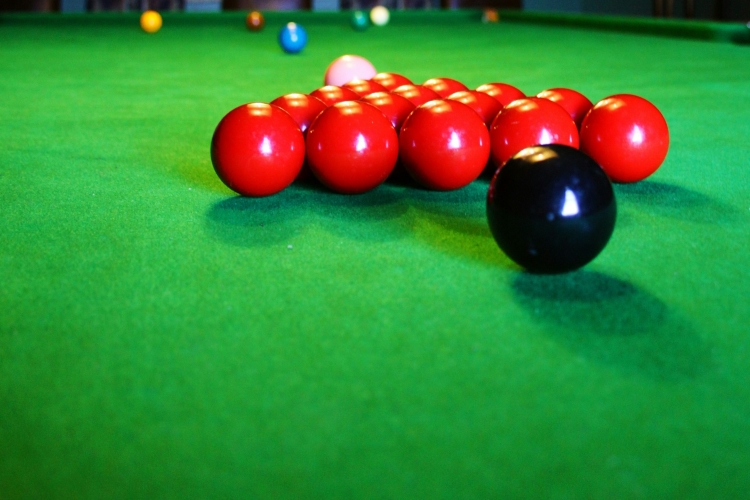

<p align="center">
  
</p>

<h1 align="center">🎱 Snooker Tournament Madrid 2026</h1>

<p align="center">
  Tournament Management Web Application
</p>

Aplicación web para la gestión y visualización de un torneo de Snooker.

El proyecto permite gestionar los grupos de clasificación, partidos, resultados, frames, horarios, mesas y fase final del torneo, con una interfaz adaptada tanto a ordenador como a dispositivos móviles.

La aplicación está diseñada para disponer de una vista pública para los jugadores y un panel de administración para gestionar los datos del torneo.

---

## 🌐 Aplicación

La aplicación está publicada mediante Netlify:

https://snookertorneomadrid.netlify.app/

Los jugadores pueden acceder al torneo mediante el enlace público o mediante un código QR.

---

## 🚀 Características Principales

- **⚡ Sincronización en Tiempo Real (Supabase Realtime):** Todos los cambios en marcadores, horarios o breaks realizados por la organización se reflejan al instante en los dispositivos de los espectadores sin necesidad de recargar la página.
- **🔒 Panel de Administración Protegido:** Modificación de resultados, marcadores, edición de nombres, asignación de mesas y reseteo del torneo mediante acceso seguro por clave (**\*\*\***).
- **🏆 Fase de Grupos + Cuadro Final:**
  - **Fase 1:** 8 Grupos de 4 jugadores (48 partidos en total).
  - **Fase Final:** Clasificación directa a **Octavos → Cuartos → Semifinales → Final**.
- **🎯 Criterios de Desempate Automáticos:**
  1. Frames ganados.
  2. Puntos totales acumulados en todos los frames.
  3. Resultado directo entre jugadores.
- **⚡ Registro de Highest Break:** Seguimiento del break máximo individual conseguido por cada jugador durante el torneo.
- **📱 Filtros Intuitivos:** Visualización separada por sede (**Vallecas / Alcobendas**) con filtros interactivos por **Grupo**, **Mesa** y **Horario**.
- **📱 Diseño Responsive & UI Snooker:** Tema oscuro optimizado con paleta verde mesa snooker, texto dorado y tipografía legible en teléfonos y tablets.

---

## 📋 Funcionalidades

### 👥 Grupos y clasificación

- Visualización de los grupos del torneo.
- Clasificación de los jugadores.
- Posición de cada jugador.
- Puntos obtenidos.
- Resultados de los partidos.
- Visualización clara y adaptada a dispositivos móviles.

### 🎱 Partidos

Cada partido muestra información como:

- Jugadores participantes.
- Resultado.
- Frames.
- Estado del partido.
- Fecha.
- Hora de comienzo.
- Mesa.
- Sede.
- Highest Break / Break máximo de cada jugador.

Los partidos disputados se diferencian visualmente de los partidos pendientes para facilitar el seguimiento del torneo.

### 📊 Desglose por frames

Los partidos permiten consultar el resultado frame por frame, manteniendo el sistema de desglose existente en el proyecto.

### 🏆 Fase final

La fase final del torneo se estructura mediante eliminatorias:

**Octavos de final → Cuartos de final → Semifinales → Final**

La estructura exacta de las rondas depende de la configuración del torneo.

### 🕐 Horarios

El torneo contempla diferentes horarios según el día:

**Viernes**

- 12:00 – 22:00

**Sábado**

- 09:00 – 22:00

**Domingo**

- Semifinales: 09:00
- Final: 13:00

Los partidos tienen una duración aproximada de 2 horas y la planificación busca proporcionar descansos razonables entre partidos para cada jugador.

### 📍 Sedes

El torneo utiliza las siguientes sedes:

- Vallecas
- Alcobendas

Los partidos pueden mostrar tanto la sede como la mesa asignada.

---

## 

## 🗄️ Base de datos

El proyecto utiliza **Supabase** como base de datos para almacenar la información del torneo.

La base de datos permite mantener una única fuente de información compartida entre todos los dispositivos.

Entre los datos gestionados se encuentran:

- Jugadores.
- Partidos.
- Resultados.
- Frames.
- Highest Break.
- Horarios.
- Mesas.
- Sedes.
- Clasificación.
- Configuración del torneo.

De esta forma, cuando un administrador modifica un resultado o cualquier otro dato, los demás usuarios pueden consultar la información actualizada desde la aplicación.

---

## 🔐 Administración

La aplicación diferencia entre dos tipos de usuarios:

### Usuario público

Los jugadores y visitantes pueden consultar:

- Grupos.
- Clasificación.
- Partidos.
- Horarios.
- Mesas.
- Resultados.
- Frames.
- Highest Break.
- Fase final.

Los usuarios públicos no deben poder modificar los datos del torneo.

### Administrador

El panel de administración permite gestionar el torneo, incluyendo:

- Jugadores.
- Partidos.
- Resultados.
- Frames.
- Highest Break.
- Horarios.
- Mesas.
- Sedes.
- Puntos.
- Reinicio de partidos.
- Reinicio del torneo.

El acceso a las funciones de modificación está restringido a administradores.

---

## 📱 Acceso mediante QR

El torneo puede compartirse mediante un código QR.

El QR dirige a la aplicación pública desplegada en Netlify:

https://snookertorneomadrid.netlify.app/

Los jugadores pueden escanear el código desde sus teléfonos y consultar el estado actual del torneo.

---

## 🛠️ Tecnologías

El proyecto utiliza tecnologías web sencillas y orientadas a una aplicación rápida y fácil de mantener.

- HTML
- CSS
- JavaScript
- Supabase
- Netlify

---

## 📁 Estructura del proyecto

```text
.
├── css/
│   └── styles.css
│
├── IMG/
│   ├── Snooker1.jpg
│   └── Snooker2.jpg
│
├── js/
│   ├── app.js
│   └── tournamentData.js
│
├── index.html
├── supabase_schema.sql
├── ESPECIFICACIONES_TORNEO_SNOOKER...
├── README.md
└── .gitignore

```

---


---

---

<h2 align="center">🎱 Snooker Tournament Madrid 2026</h2>

<p align="center">
  Tournament management web application
</p>

<p align="center">
  
</p>

<br>

<p align="center">
  <a href="https://github.com/dwp28">
    
  </a>
  <a href="https://snookertorneomadrid.netlify.app/">
    
  </a>
</p>

<br>

<p align="center">
  Developed by <b>Daniel Willson</b>
</p>

<p align="center">
  Computer Engineering Student
</p>

<p align="center">
  <a href="https://github.com/dwp28">
    
  </a>
</p>

---

<p align="center">
  <i>Built with HTML, CSS, JavaScript & Supabase</i>
</p>
