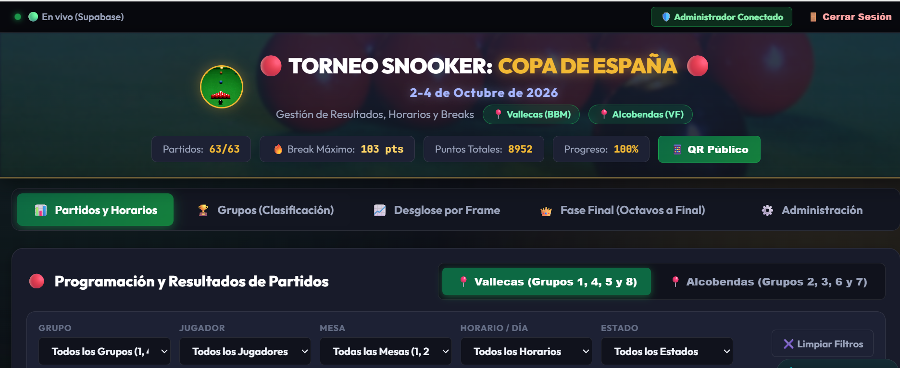
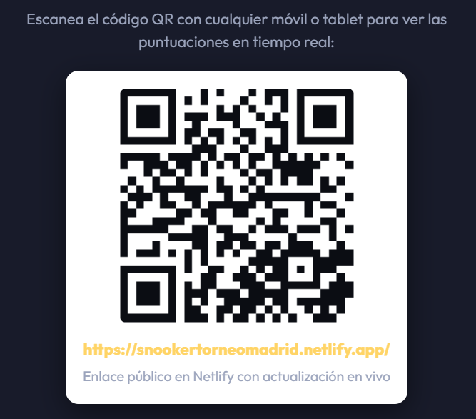

<p align="center">
  
</p>

<h1 align="center">🎱 Torneo Snooker Madrid 2026 - Copa de España</h1>

<p align="center">
  <a href="https://snookertorneomadrid.netlify.app/">
    
  </a>
  <a href="https://github.com/dwp28">
    
  </a>
</p>

<p align="center">
  
</p>

---

## 🏆 Acerca del Proyecto

Esta aplicación web ha sido desarrollada a petición de la **Federación Española de Snooker** para la **Copa de España de Snooker**, que se celebró en Madrid los días **2, 3 y 4 de Octubre de 2026**.

El objetivo principal de este software es **sustituir las antiguas hojas de Excel** por una plataforma interactiva, moderna y en tiempo real. Esto permite tanto a los **jugadores** como a los **espectadores** seguir el transcurso del torneo en vivo desde sus teléfonos móviles, mientras la organización gestiona los cuadros y marcadores fácilmente desde el Panel de Administración.

<p align="center">
  
</p>

---

## 📍 Sedes y Clubes Oficiales

El torneo se disputa simultáneamente en dos de los mejores clubes de Madrid. Puedes hacer clic en los enlaces para visitar sus páginas oficiales:

- 🔴 **Sede Vallecas:** [Black Ball Madrid](https://blackballmadrid.com/)
- 🔴 **Sede Alcobendas:** [Club Snooker Valdelasfuentes](https://www.instagram.com/csvaldelasfuentes/)

---

## 🚀 Funcionalidades Principales

- **⚡ Sincronización en Tiempo Real (Supabase):** Los marcadores, breaks y avances de ronda se actualizan solos en todos los dispositivos sin tener que recargar la página.
- **📱 Código QR de Acceso:** Los asistentes pueden escanear el QR en las pantallas de los clubes para abrir la App directamente en su móvil.
  <br>
  
- **🔒 Modo Administrador:** Mediante contraseña, los organizadores pueden editar marcadores (frame a frame), modificar fechas, añadir enlaces de YouTube de las retransmisiones y generar el cuadro de la Fase Final.
- **👀 Modo Espectador (Solo Lectura):** Acceso público seguro donde el público solo puede visualizar el desarrollo de los grupos y el cuadro eliminatorio.
- **🎯 Desempates y Cuadros Automáticos:** El sistema calcula los puestos de grupo de forma autónoma siguiendo las normativas de la federación (Partidos ganados > Diferencia de frames > Enfrentamiento directo).

---

## ⚙️ Arquitectura y Flujo de Trabajo (Workflow)

El proyecto destaca por tener una arquitectura 100% _Serverless_ y de bajo coste, utilizando tecnologías nativas web (Vanilla JS, HTML, CSS) orquestadas con herramientas modernas en la nube:

### 1. Base de Datos en Vivo (Supabase)

Toda la estructura del torneo y los resultados se almacenan en un objeto JSON reactivo dentro de PostgreSQL en **Supabase**. Gracias a la API de `Supabase Realtime`, todos los clientes web (navegadores) están suscritos a los cambios y se actualizan de inmediato al haber una modificación.

### 2. Mantenimiento Automático (GitHub Actions)

Dado que los proyectos gratuitos en Supabase entran en estado de _stand-by_ tras 7 días de inactividad, se ha implementado un flujo de trabajo (`workflow`) en GitHub Actions (`.github/workflows/keepalive.yml`).

- **¿Qué hace?** Se ejecuta de forma invisible cada 2 días haciendo un "ping" a la base de datos para mantenerla activa de forma permanente, sin coste alguno.
- **Seguridad:** Utiliza GitHub Secrets (`SUPABASE_URL` y `SUPABASE_ANON_KEY`) de forma segura para autenticar la petición.

### 3. Despliegue y Seguridad (Netlify)

La web está alojada y servida globalmente a través de **Netlify**. Para solucionar el problema de mantener el repositorio público en GitHub sin exponer las contraseñas de administración, se implementó un proceso de construcción personalizado:

- **El problema:** El escáner de secretos de Netlify (Secret Scanner) bloquea la subida si detecta una contraseña literal en el código publicado.
- **La solución (`netlify.toml` + `build.js`):** Durante el proceso de construcción (_build_) en los servidores de Netlify, el script `build.js` lee las contraseñas seguras, las **codifica en Base64**, y genera el archivo `js/config.js`.
- Al estar en Base64, el escáner aprueba la publicación. Al cargar la página, el navegador del usuario decodifica la clave usando `atob()` de forma completamente invisible, garantizando la seguridad en el repositorio y la funcionalidad en la web.

---

## 📁 Estructura del Código

```text
.
├── css/
│   └── styles.css          # Estilos premium oscuros, animaciones y diseño responsive
├── IMG/                    # Recursos gráficos (logos, QR, imágenes de las sedes)
├── js/
│   ├── app.js              # Lógica principal, autenticación y Supabase Realtime
│   └── tournamentData.js   # Esquema inicial y configuración por defecto
├── .github/workflows/
│   └── keepalive.yml       # Automatización (Cron) para mantener Supabase activo
├── build.js                # Script NodeJS pre-despliegue para ofuscación de secretos (Base64)
├── netlify.toml            # Configuración del motor de despliegue en Netlify
├── index.html              # Estructura principal de la SPA (Single Page Application)
└── README.md
```

---

<p align="center">
  
</p>

---

<p align="center">
  Developed by <b>Daniel Willson</b><br>
  <i>Computer Engineering Student</i>
</p>

<p align="center">
  <a href="https://github.com/dwp28">
    
  </a>
</p>
